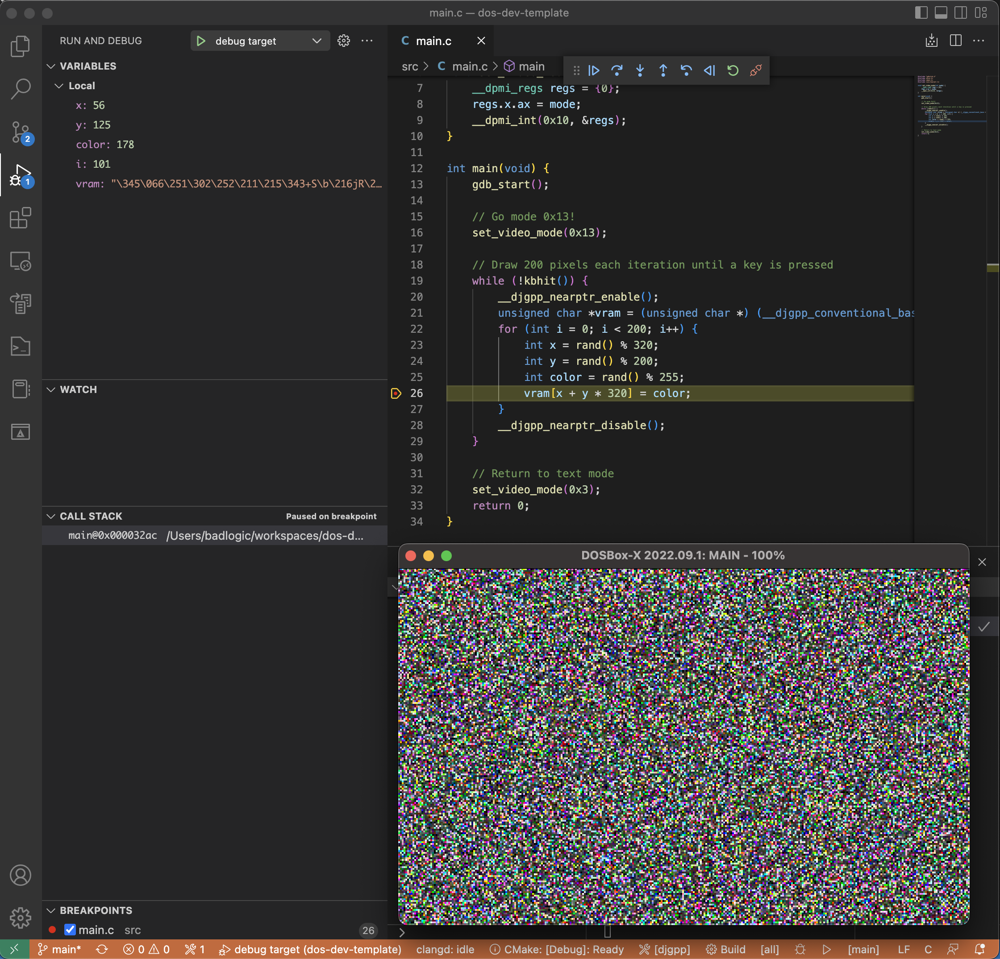

# DOS demo/game development template


Want to relieve the 90ies and create little demos and games for DOS using C/C++ with "modern" tools? Then this project template is for you.

It's a turn key solution to setup a develpoment environment to create DOS demos/apps. consisting of:

* [DJGPP](https://www.delorie.com/djgpp/), the GCC-based C/C++ compiler for DOS (DPMI/protected mode).
* [GDB](https://www.sourceware.org/gdb/), the debugger used to debug the DOS demo/game.
* [DOSBox-x](https://dosbox-x.com/), the bells and whistles DOS-emulator to develop and run the DOS demo/game in.
* [CMake](https://cmake.org/), to define what needs to be build how.
* [Visual Studio Code](https://code.visualstudio.com/), to tie all the above together and provide an integrated development environment.

## Quickstart Guide

### Installation
Install:

* [Git](https://git-scm.com/): On Windows, install [Git for Windows](https://gitforwindows.org/). You will need `Git Bash` to run a shell script later.
* [CMake](https://cmake.org/): ensure `cmake` is in your `PATH`.
* [Visual Studio Code](https://code.visualstudio.com/): ensure [command line interface is installed](https://www.digitalocean.com/community/tutorials/how-to-install-and-use-the-visual-studio-code-vs-code-command-line-interface) and in your `PATH`.

Open a shell (Git Bash on Windows), then:

```
git clone https://github.com/badlogic/dos-dev-template
cd dos-dev-template
./download-tools.sh
```

The `download-tools.sh` script will download everything you need to start developing for DOS.

Once complete, open the `dos-dev-template/` folder in Visual Studio Code.

### Running and debugging
Open the `Run and debug` view as shown in the screenshot above, then start one of the two launch configurations:

* `debug target`: builds and launches the currently selected [CMake launch target](https://vector-of-bool.github.io/docs/vscode-cmake-tools/debugging.html) in DOSBox-x, and attaches the debugger.
* `run target`: builds and launches the currently selected CMake launch target in DOSBox-x without attaching a debugger.

> Make sure the [Cmake Build Variant](https://stackoverflow.com/a/73329010) matches the launch configuration, e.g. set the `Debug` variant when launching `debug target`, and the `Release` variant when launching the `run target`. Otherwise, the debugger may not be able to attach (`Release` variant when launching `debug target`), or the program may hang, waiting for the debugger (`Debug` variant when launching `release target`)

The debugger has a few limitations & gotchas:

* You can not set breakpoints while the program is running. Set breakpoints before launching a debugging session, or while the program is halted after hitting a breakpoint, stepped, or was interrupted.
* The debugger is quite a bit slower than what you may be used to. This is due to the use of the serial port emulation for communication.
* Always make sure to close the DOSBox-x window before launching a new debugging session.
* If the debugger appears to be stuck, either wait for it to timeout, or execute the `Debug: Stop` command from the command palette.
* When you click the debugger's `Pause` button or press `F6` to pause the program, you will end up in an interrupt handler. Don't get confused, simply switch to a source file, set a breakpoint and resume.
* In general, the debugging support is one big hack, there may be dragons. Still better than `printf`-ing your way through life!

## Writting code
Easy, just open or create a new `.h`, `.c`, or `.cpp` file in the `src/` folder and type away. You will get full code completion, navigation and what young people call "lints". Newly created files will be added to the build automatically.

Your code is compiled with [DJGPP](https://www.delorie.com/djgpp/doc/eli-m17n99.html), which means it will become a beautiful 32-bit protected mode application. Check out the resources below to get your DOS programming juices flowing:

* [256-Color VGA Programming in C](http://www.brackeen.com/vga/index.html), a 5 part tutorial on VGA programming, using DJGPP.
* [The Art of Demomaking](https://www.flipcode.com/archives/The_Art_of_Demomaking-Issue_01_Prologue.shtml), a 16 part series explaining and demonstrating various demo effects, using DJGPP.
* [Brennan's Guide to Inline Assembly](http://www.delorie.com/djgpp/doc/brennan/brennan_att_inline_djgpp.html), in case you want to speed up your app with some artisan, hand-crafted assembly.

## Asset files
While you can do a lot with just code, sometimes you need a good old file. Put the files for your program in the `assets/` folder. The file will then be available to your program via the path `assets/<your-file-name>`, which you can pass to e.g. `fopen()`.

## Building and running from the command line
If you don't like graphical user interfaces, you can also do all of the above from the command line.

### Building
```
cmake -DCMAKE_BUILD_TYPE=Debug -DCMAKE_TOOLCHAIN_FILE=tools/toolchain-djgpp.cmake -S . -B build
```

This configures your build to produce a debug binary. For a release binary, specify `-DCMAKE_BUILD_TYPE=Release`. You generally run this command only when your build type changes.

Once configured, you can build the program as follows:
```
cmake --build build
```

This puts the executable file and assets in the `build/` directory.

### Running
```
./tools/dosbox-x/dosbox-x -fastlaunch -exit -conf tools/dosbox-x.conf build/main.exe
```

Launches the executable in DOSBox-x. Make sure to build with `-DCMAKE_BUILD_TYPE=Release` before launching.

### Debugging
```
./tools/dosbox-x/dosbox-x -fastlaunch -exit -conf tools/dosbox-x.conf build/main.exe
```

Launches the executable in DOSBox-x. Make sure to build with `-DCMAKE_BUILD_TYPE=Debug` before launching.

In a second shell:

```
./tools/gdb/gdb
(gdb) file build/main.exe
(gdb) target remote localhost:5123
```

GDB will connect to the program running in DOSBox-x. See the [GDB cheat sheet](https://darkdust.net/files/GDB%20Cheat%20Sheet.pdf) on how to use the command line driver of GDB.


## FAQ

Here are a few questions you may have, if you want to dig deeper into the entire setup to modify it to your liking.

### What does `download-tools.sh` do?

It will download the following tools for your operating system to the `tools/` folder:

*  My fork of [GDB 7.1a](https://github.com/badlogic/gdb-7.1a-djgpp), which is specifically build to debug DOS programs compiled with DJGPP remotely, e.g. running in DOSBox-x.
* [DJGPP binaries](https://github.com/badlogic/dosbox-x) provided by [Andrew Wu](https://github.com/andrewwutw)
* My fork of [DOSBox-x](https://github.com/badlogic/dosbox-x), which fixes a few things required for debugging, such as [serial port emulation through TCP/IP on macOS](https://github.com/joncampbell123/dosbox-x/pull/3892).

After downloading the tools, it will install these Visual Studio Code extensions necessary for C/C++ development:

* [clangd](https://marketplace.visualstudio.com/items?itemName=llvm-vs-code-extensions.vscode-clangd), the superior C/C++ code completion, navigation, and insights language service.
* [CMake Tools](https://marketplace.visualstudio.com/items?itemName=ms-vscode.cmake-tools), for CMake support in VS Code
* [C/C++ for Visual Studio Code](https://code.visualstudio.com/docs/languages/cpp), needed to do anything C/C++ in VS Code. It's less than great intellisense service is replaced by clangd though.
* [Native Debug Extension](https://marketplace.visualstudio.com/items?itemName=webfreak.debug), provides the high-level debugger capanble of using GDB.

### How does the debugging work?
I'm glad you ask! It's an unholy ball of duct tape consisting of:

* [A GDB stub](/src/gdbstub.h), implemented as a header-file only library. It implements the [GDB remote protocol](https://sourceware.org/gdb/onlinedocs/gdb/Remote-Protocol.html) and is included in the program itself, which it will then control and "expose" to the debugger for inspection and modification. It's a heavily modified and extended version of [Glenn Engel & Jonathan Brogdon GDB stub](http://ftp.lanet.lv/ftp/mirror/x2ftp/msdos/programming/djgpp/v2misc//gdbst01s.zip), so it can actually do all the things expected of a somewhat modern debugger. I would suggest not looking into that file. It was not build with love or care, just enough spite so it gave up and started working. Mostly.
* [A custom, minimal build of GDB 7.1a](https://github.com/badlogic/gdb-7.1a-djgpp), one of the last versions of GDB to support `COFF_GO32` executables as produced by DJGPP.
* [A modified version of DOSBox-x](https://github.com/badlogic/dosbox-x), which was necessary as serial port communication over TCP/IP was broken on macOS. My [pull request](https://github.com/joncampbell123/dosbox-x/pull/3892) was merged, so hopefully this template can switch over to the official DOSBox-x build eventually.

And here's how it works:

1. DOSBox-x is configured to expose serial port 0 (COM1) to the outside world via TCP on port 5123 in nullmodem, non-handshake mode.
1. The program is started in DOSBox-x and first calls `gdb_start()`. This function initializes the serial port to use the highest baud rate possible, then triggers a breakpoint via `int 3`. This in turn triggers a special signal handler implemented in the GDB stub which listens for incoming data from the serial port.
1. The debugger (GDB) is told to connect to a remote process via TCP at address localhost:5123. This establishes a connection to the signal handler that waits for data coming in on the serial port.
1. GDB sends commands, like set a breakpoint, step, or continue, which the signal handler interprets and executes.
1. As a special case, if the program is running and the debugger wants to interrupt it to set further breakpoints or get information, the GDB stub also hooks the timer interrupt to poll the serial port state. In case there's data waiting, it will call the signal handler, which then takes over processing the new debugger commands.

In theory, all of this is very simple. In practice, it can fall apart in the most creative ways. The implementation was tested with the included GDB version, as well as the Native Debugger extension which sits on top the included GDB version.

I can make no guarantees it will work with other GDB versions or higher level debuggers as found in e.g. CLion, etc. It should. But it might not, as most debuggers don't stick to the protocol spec.

### What are all those files in `.vscode`
These are configuration files for the various extensions and VS Code itself to provide you with a passable out-of-the-box experience.

* [cmake-kits.json](.vscode/cmake-kits.json) tells the CMake Tools extension about the DJGPP toolchain, which is defined as a CMake toolchain file in [tools/toolchain-djgpp.cmake](tools/toolchain-djgpp.cmake)
* [launch.json](.vscode/launch.json) defines the 2 launch configurations `debug target` and `run target`. They in turn depend on tasks defined in [tasks.json](.vscode/tasks.json)
* [settings.json](.vscode/settings.json) turns off the not great C/C++ extension intellisense and configures a few other minor things.

